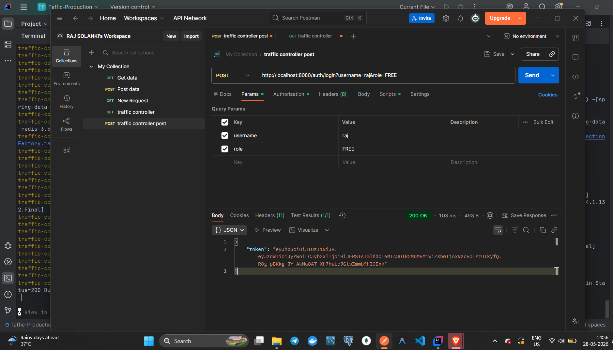

# 🚦 Enterprise API Traffic Control & Rate Limiting System

A production-grade distributed rate-limiting backend built with **Spring Boot**, **Redis**, **JWT Authentication**, **Docker**, and **Lua Scripting** — simulating how modern API gateways control traffic, prevent abuse, and ensure fair usage across user roles.

---

## 📌 Overview

Modern applications receive thousands of API requests every minute. Without traffic control, excessive requests from users or bots can overload servers, degrade performance, or cause outages.

This project implements a **distributed Token Bucket Rate Limiter** that controls API traffic based on user roles, with atomic Redis Lua execution ensuring zero race conditions under concurrent load.

---

## ✨ Features

| Feature | Details |
|---|---|
| 🔐 JWT Authentication | Stateless auth with Spring Security filter-chain |
| 🚦 Token Bucket Rate Limiting | Per-user, per-role limits enforced via Redis |
| ⚛️ Atomic Lua Execution | Race-condition-free request processing |
| 👥 Role-Based Access Control | FREE / PREMIUM / ADMIN with different limits |
| 🐳 Dockerized Deployment | Full setup via Docker Compose |
| 📋 Request Logging | Every request logged with status and token count |
| ⚠️ Global Exception Handling | Clean error responses across all endpoints |

---

## 👥 User Roles & Rate Limits

| Role | Capacity | Refill Rate |
|---|---|---|
| FREE | 5 Tokens | 1 Token/sec |
| PREMIUM | 100 Tokens | 5 Tokens/sec |
| ADMIN | Unlimited | Unlimited |

---

## 🛠️ Tech Stack

| Layer | Technology |
|---|---|
| Backend | Java 21, Spring Boot, Spring MVC |
| Security | Spring Security, JWT |
| Rate Limiting | Redis, Lua Scripting |
| DevOps | Docker, Docker Compose |
| Build | Maven |
| Testing | Postman |

---

## 🏗️ System Architecture

```
                    +----------------+
                    |     Client     |
                    +----------------+
                            |
                            ▼
             +---------------------------+
             | JWT Authentication Filter |
             +---------------------------+
                            |
                            ▼
               +------------------------+
               |   Rate Limit Filter    |
               +------------------------+
                            |
                            ▼
              +-------------------------+
              |  RateLimiter Service   |
              +-------------------------+
                            |
                            ▼
         +--------------------------------------+
         | Redis + Lua Token Bucket Algorithm   |
         +--------------------------------------+
                    |              |
                  ALLOW          BLOCK
                  200 OK       429 Too Many
```

---

## 🔄 How It Works — Request Flow

**Step 1 — Login & get JWT**
```http
POST /auth/login?username=raj&role=FREE
→ Returns JWT token
```

**Step 2 — Call protected API**
```http
GET /limited
Authorization: Bearer <JWT_TOKEN>
```

**Step 3 — JWT Filter validates token, extracts username + role**

**Step 4 — Rate Limit Filter calls `RateLimiterService.allowRequest()`**

**Step 5 — Redis Lua script runs atomically:**
- Reads current token count
- Calculates refill since last request
- Adds new tokens (up to capacity)
- Consumes 1 token
- Saves updated bucket

**Step 6 — Response:**
```
Allowed  → HTTP 200 OK         "Request Allowed"
Blocked  → HTTP 429            "Rate limit exceeded!"
```

---

## 🔑 API Endpoints

### Generate JWT Token
```http
POST /auth/login?username=raj&role=FREE
```
```json
{
  "token": "eyJhbGc..."
}
```

### Call Protected Endpoint
```http
GET /limited
Authorization: Bearer YOUR_TOKEN
```

---

## 🚀 Getting Started

### Prerequisites
- **Java 21+** — [Download](https://adoptium.net/)
- **Docker & Docker Compose** — [Download](https://www.docker.com/products/docker-desktop/)
- **Postman** — [Download](https://www.postman.com/downloads/)

> Redis runs automatically via Docker — no separate install needed.

### 1. Clone the Repository
```bash
git clone https://github.com/Rajsolanki0907/Enterprise-API-Traffic-Control-System.git
cd Enterprise-API-Traffic-Control-System
```

### 2. Build the Project
```bash
mvn clean package
```

### 3. Start All Containers
```bash
docker-compose up --build
```
This starts both the Spring Boot app and Redis server automatically.

### 4. Verify Containers Running
```bash
docker ps
```
You should see:
```
traffic-control-system
redis-rate-limiter
```

### 5. Generate JWT in Postman
```
POST http://localhost:8080/auth/login?username=raj&role=FREE
```
Copy the token from the response.

### 6. Test the Rate Limiter
```
GET http://localhost:8080/limited
Header → Authorization: Bearer <TOKEN>
```
Send it repeatedly — after the FREE limit (5 tokens) is hit, you'll get:
```json
{
  "status": 429,
  "error": "Too Many Requests",
  "message": "Rate limit exceeded!"
}
```

---

## 🐳 Docker Commands

```bash
docker-compose up --build   # Build and start
docker-compose up           # Start (already built)
docker-compose down         # Stop all containers
docker-compose build        # Build only
```

---

## 📁 Project Structure

```
traffic-control-system/
├── src/main/java/com.raj.traffic_control_system/
│   ├── config/         # Redis + Security config
│   ├── controller/     # API endpoints
│   ├── exception/      # Global exception handling
│   ├── filter/         # JWT + Rate limiting filters
│   ├── service/        # RateLimiterService
│   ├── util/           # Helpers
│   └── security/       # Spring Security setup
├── src/main/resources/
│   ├── application.properties
│   └── tokenBucket.lua  # Redis Lua script
├── Dockerfile
├── docker-compose.yml
└── pom.xml
```

---

## 📷 Screenshots

> Add your screenshots to an `images/` folder in the repo root.

### JWT Token Generation


### Request Allowed (200 OK)


### Rate Limit Exceeded (429)


### Docker Containers Running


### Redis Keys in CLI


---

## 💡 Challenges & Solutions

| Challenge | How I Solved It |
|---|---|
| Redis connection inside Docker | Fixed container networking in docker-compose.yml |
| Race conditions under load | Used Redis Lua scripts for atomic execution |
| Token refill accuracy | Timestamp-based refill calculation in Lua |
| JWT filter ordering | Configured Spring Security filter chain order explicitly |
| Redis serialization errors | Configured correct RedisTemplate serializers |

---

## 🔮 Future Improvements

- [ ] Prometheus + Grafana monitoring dashboard
- [ ] Kubernetes deployment
- [ ] Multiple rate limiting algorithms (Sliding Window, Leaky Bucket)
- [ ] CI/CD pipeline with GitHub Actions
- [ ] API usage analytics dashboard
- [ ] Microservice integration

---

## 📚 Concepts Demonstrated

`Spring Boot` `Spring Security` `JWT` `Redis` `Lua Scripting` `Token Bucket Algorithm` `Docker` `Docker Compose` `REST APIs` `Distributed Systems` `Rate Limiting` `RBAC` `Request Logging` `Exception Handling`

---

## 👨‍💻 Author

**Raj Solanki** — Java Backend Developer

- 📧 [rajsolanki0907@gmail.com](mailto:rajsolanki0907@gmail.com)
- 💼 [LinkedIn](https://www.linkedin.com/in/rajsolanki09/)
- 🐙 [GitHub](https://github.com/Rajsolanki0907)

---

⭐ **If this project helped you, please star the repository!**
