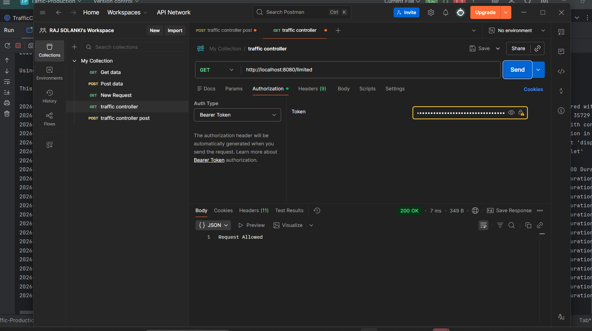
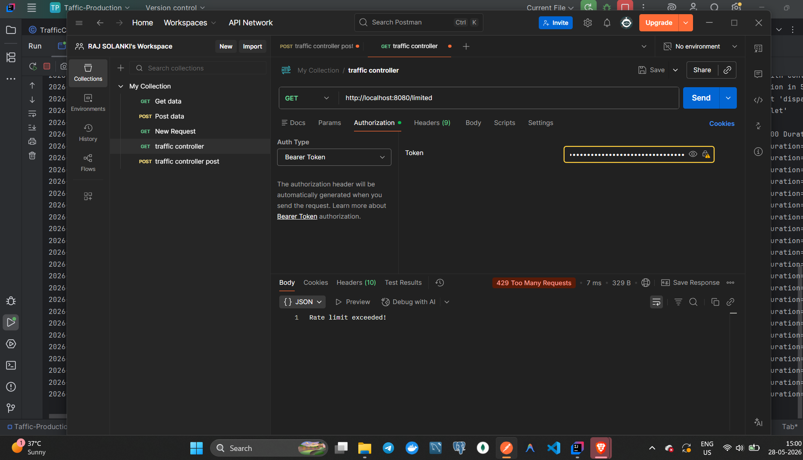
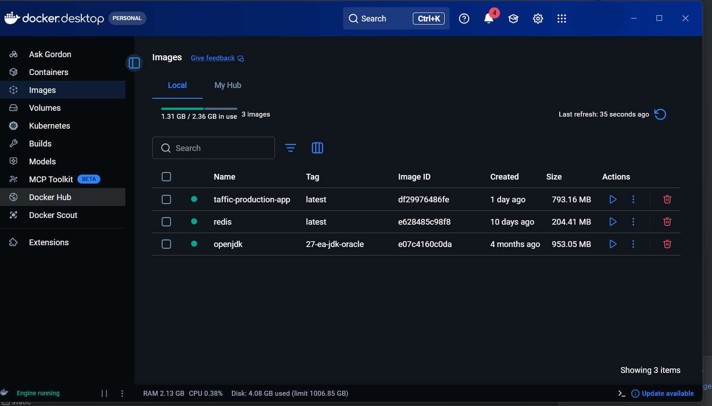

# Enterprise API Traffic Control & Rate Limiting System

## Overview

Enterprise API Traffic Control & Rate Limiting System is a backend project built using Spring Boot, Redis, JWT Authentication, Docker, and Lua scripting. The system controls API traffic using a distributed Token Bucket algorithm and provides role-based request throttling for different user plans.

The project simulates real-world API Gateway behavior used in scalable backend systems to prevent API abuse, manage traffic efficiently, and secure endpoints.

---

## Features

### Authentication & Security

* JWT-based Stateless Authentication
* Spring Security Integration
* Role-Based Access Control
* Protected REST APIs

### Traffic Control

* Distributed Token Bucket Rate Limiting
* Atomic Redis Operations using Lua Scripts
* Role-Based Request Limits
* Automatic Token Refill Mechanism

### User Plans

* FREE User
* PREMIUM User
* ADMIN User

### Monitoring & Reliability

* Request Logging
* Global Exception Handling
* Centralized Error Responses
* Dockerized Deployment

---

## Tech Stack

### Backend

* Java 21
* Spring Boot
* Spring Security
* Spring MVC

### Data Layer

* Redis

### Authentication

* JWT (JSON Web Token)

### DevOps

* Docker
* Docker Compose

### Scripting

* Lua

### Build Tool

* Maven

---

## System Architecture

```text
Client
   |
   v
JWT Authentication Filter
   |
   v
Rate Limit Filter
   |
   v
Rate Limiter Service
   |
   v
Redis + Lua Script
   |
   v
Controller
   |
   v
Response
```

---

## Project Structure

```text
src/main/java/com/raj/traffic_control_system

├── config
│   ├── RedisConfig
│   ├── RedisLuaConfig
│   └── SecurityConfig
│
├── controller
│   ├── AuthController
│   └── RateLimiterController
│
├── exception
│   ├── ApiError
│   └── GlobalExceptionHandler
│
├── filter
│   ├── JwtAuthenticationFilter
│   ├── RateLimitFilter
│   └── LoggingFilter
│
├── service
│   └── RateLimiterService
│
├── util
│   └── JwtUtil
│
└── TrafficControlSystemApplication
```

---

## How It Works

### Step 1: User Login

User requests a JWT token.

```http
POST /auth/login?username=raj&role=FREE
```

Response:

```json
{
  "token": "JWT_TOKEN"
}
```

---

### Step 2: Access Protected API

```http
GET /limited
Authorization: Bearer JWT_TOKEN
```

---

### Step 3: JWT Validation

The JWT filter validates the token and extracts:

* Username
* User Role

Example:

```text
Username : raj
Role     : FREE
```

---

### Step 4: Rate Limit Check

The RateLimitFilter sends user details to RateLimiterService.

The service determines:

* Bucket Capacity
* Refill Rate

Based on the user's role.

---

### Step 5: Redis Lua Execution

The Lua script:

* Reads current token count
* Calculates refill amount
* Updates bucket
* Checks request eligibility

All operations execute atomically inside Redis.

---

### Step 6: Response

Allowed:

```http
200 OK
Request Allowed
```

Blocked:

```http
429 Too Many Requests
Rate limit exceeded!
```

---

## Role Configuration

| Role    | Capacity   | Refill Rate |
| ------- | ---------- | ----------- |
| FREE    | 5 Tokens   | 1/sec       |
| PREMIUM | 100 Tokens | 5/sec       |
| ADMIN   | Unlimited  | Unlimited   |

---

## API Endpoints

### Generate JWT

```http
POST /auth/login
```

Parameters:

```text
username
role
```

Example:

```http
POST /auth/login?username=raj&role=FREE
```

---

### Protected Endpoint

```http
GET /limited
```

Headers:

```http
Authorization: Bearer <JWT_TOKEN>
```

---

## Docker Setup

### Build Project

```bash
mvn clean package
```

### Start Containers

```bash
docker-compose up --build
```

### Stop Containers

```bash
docker-compose down
```

---

## Running Without Docker

### Start Redis

```bash
docker run -d --name redis-rate-limiter -p 6379:6379 redis
```

### Run Spring Boot

```bash
mvn spring-boot:run
```

---

## Key Concepts Demonstrated

* Distributed Systems
* API Gateway Design
* Token Bucket Algorithm
* Redis Caching
* Atomic Operations
* Lua Scripting
* JWT Authentication
* Spring Security
* Docker Deployment
* Request Throttling
* Backend Architecture

---

## Challenges Faced

### Redis Connectivity Issues

Resolved Docker container networking and hostname configuration.

### Serialization Problems

Migrated rate-limiting state management from Java objects to Redis-based Lua scripts.

### Token Refill Logic

Implemented and debugged time-based token refill behavior for accurate traffic control.

### Docker Build Caching

Resolved stale resource issues through clean rebuilds and image management.

---

## Future Improvements

* Prometheus Metrics Integration
* Grafana Monitoring Dashboard
* API Usage Analytics
* Admin Dashboard
* Kubernetes Deployment
* Multiple Rate Limiting Strategies
* Microservices Support

---

## Screenshots

Add screenshots here:

### JWT Generation


### Successful Request



### Rate Limit Exceeded



### Docker Containers



### Redis Keys


---

## Author

Raj Solanki

* LinkedIn: https://www.linkedin.com/in/rajsolanki09/
* GitHub: https://github.com/Rajsolanki0907

---

## License

This project is intended for educational and portfolio purposes.
